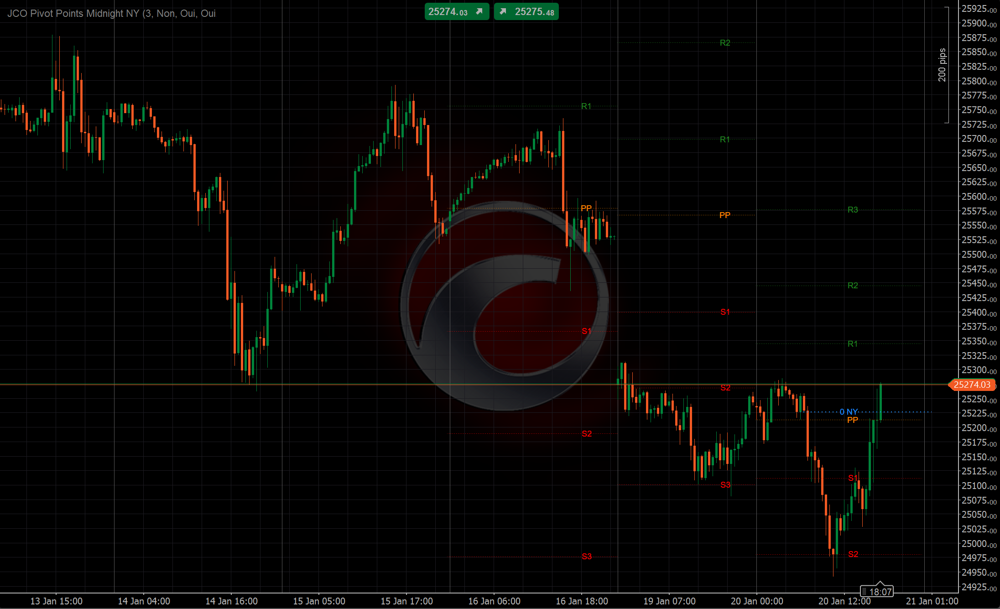

# JCO Pivot Points NY Midnight

Indicator for cTrader that displays daily pivot points (PP, S1-S3, R1-R3) and the New York midnight opening price line.

## Features

- **Classic Pivot Points**: PP, R1, R2, R3, S1, S2, S3 calculated from previous day's high, low, and close
- **NY Midnight Line**: Shows the opening price at New York midnight (00:00 EST)
- **Multi-day display**: Configure how many days of pivot points to show
- **Fully customizable**: Colors, line thickness, and line styles for each element
- **Extend lines option**: When showing 1 day, lines can extend to the beginning of the chart

## Parameters

| Parameter | Description | Default |
|-----------|-------------|---------|
| Days to Show | Number of days of pivot points to display | 3 |
| Extend Lines | Extend lines to chart start (when 1 day) | false |
| Show NY Midnight | Display the NY midnight line | true |
| Show Pivot Point | Display the PP line | true |
| Show Supports/Resistances | Display S1-S3 and R1-R3 | true |

### Customization Groups

- **Midnight**: Color, thickness, and style for the NY midnight line
- **Pivot Point**: Color, thickness, and style for PP
- **Resistances**: Color, thickness, and style for R1-R3
- **Supports**: Color, thickness, and style for S1-S3
- **Labels**: Font size for level labels
- **General**: Time zone setting

## Installation

1. Download the `.cs` file
2. Open cTrader
3. Go to Automate > Indicators
4. Click "New Indicator" or import the file
5. Build and add to your chart

## Author

J. Cornier

## License

MIT
